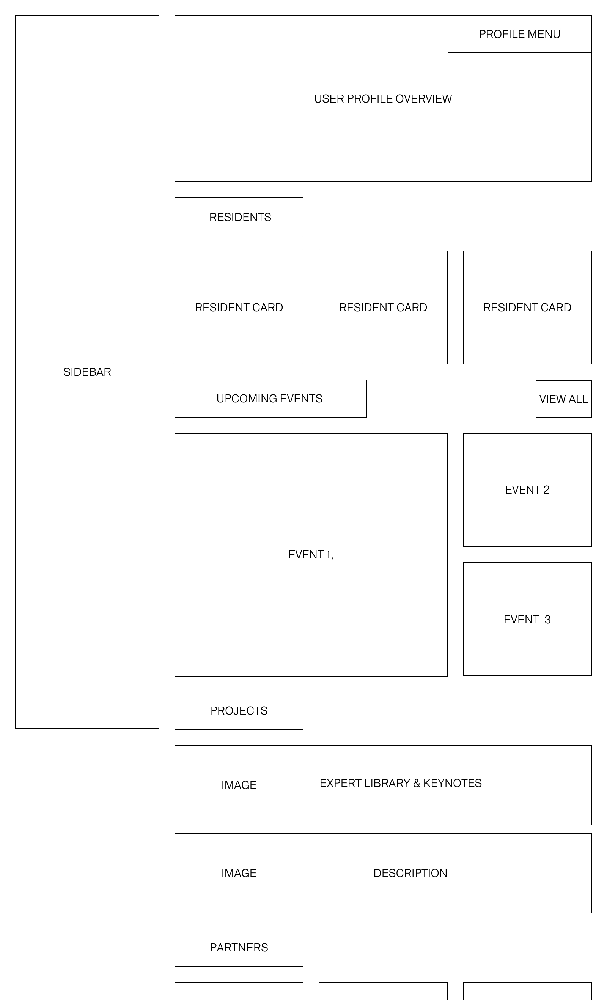
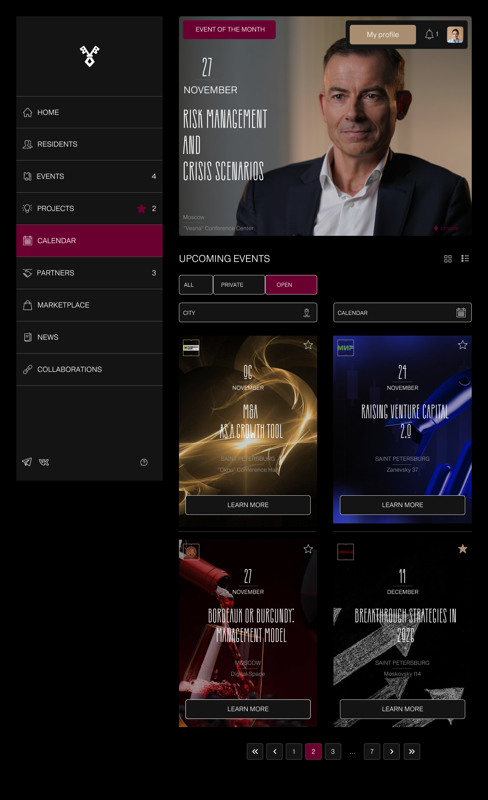

# 💼 Portfolio: Case study "Barganets"-digital ecosystem for a business club
Barganets is a private digital service for business club members. It brings together networking, an event calendar, and personal project management in one place.  The product was created entirely from scratch, only the business goal: create a service for a business club with a simple and intuitive interface for interacting with club activities. 

## 1. Project overview
I had to independently lay the foundation for a product that would become the primary tool for hundreds of entrepreneurs.

* **My role:** UX-designer. From market research and information architecture design to creating the visual language and finalizing layouts for development.
* **Timeline:** 1.5 months.

## 2. Research and product approach
The work began with an analysis of the environment and competitors. I studied how popular networking platforms and closed communities are structured. This helped not to "reinvent the wheel," but to immediately aim at the pain points of real users.

### What I discovered:
* **Visual chaos:** Most services try to cram everything and all at once onto one screen. As a result, the interface looks like a complex table, in which it is difficult for an ordinary user or a busy entrepreneur to quickly orient themselves.
* **"Complex" networking:** Finding the right person among hundreds of residents was a real quest. Information about competencies was hidden deep in profiles, which killed the main value of the club — fast and useful connections.
* **Lack of focus:** Competitors often have no clear separation into "important now" and "reference information," causing users to miss interesting events.

Many business platforms look like complex accounting tables. It was necessary to test the established hypothesis that such an approach overloads the user and kills the desire to use the service.

### Testing on competitors:
To verify this, I conducted testing on the interfaces of competitors. I asked respondents to find specific information in already existing solutions.

**What was revealed during the tests:**
* **"Wall of figures":** People spent 15–20 seconds to find the right row in the table. They literally waded through the text, often missing important notifications.
* **Visual rejection:** Users admitted that an interface similar to Excel causes them boredom and a desire to close the tab.

### How it affected my project:
I realized that my product should be "clean" and straightforward. Instead of endless lists, I emphasized a card system with key tags (business niche, expertise) and a smart Dashboard that suggests what to focus on today.

## 3. Work process
### Building information architecture
The first step to designing the interface was creating the service structure and user journey map. For a business club, it is critically important that a participant (often a busy entrepreneur) does not waste time searching for the necessary function.

* **Why it was needed:** This helped identify "bottlenecks" in navigation and understand how to combine scattered activities (events, networking, knowledge base) into a single ecosystem so that the user could get value from the club in 2–3 clicks.
* **Conclusion:** Design should work at the speed of thought. I decided to abandon standard grids in favor of an intuitive hierarchy of blocks.

### Designing logic: To make everything work "as it should"
Although I did not build complex technical schemes on the backend, my task was to think through User Flows — that is, how the user will physically move through the application.

* **Seamless path:** I designed scenarios so that a person does not end up in a dead end. For example, if they enter "Events," they can study the speaker's profile in one click, and from there — immediately go to the chat.

*Visualizing the initial information architecture and layout structure.*

## 4. Key design solutions

### №1. Visual hierarchy
Based on tests, I realized that an entrepreneur does not need to see everything and all at once — they need a quick answer to the question "What is happening?".

* **Solution:** I abandoned monotonous lists in favor of large information blocks and accent cards.
* **Implementation:** In the "Events" block, I highlighted the date and status of the event with bright labels — now the user does not need to read small text to understand when the event will be.
* **Theme:** I used a dark theme with contrast accents to visually separate personal data from the general club content. Everything important is in sight, everything secondary is in the background.

*Example of the event management flow and navigation logic.*

### №2. Dashboard that Saves Time
The main screen became the "mission control center."

* **Solution:** I brought only the "hottest" items there: the nearest event and notifications.
* **Implementation:** To avoid overloading the screen, I hid everything else in a concise sidebar. I added digital indicators (badges) there so that the user sees the number of new events or messages without going to the sections themselves.

*Minimized sidebar with intuitive icons to reduce cognitive load.*

### №3. Networking in two clicks
I reviewed the format of the resident list, making it look like a modern talent showcase.

* **Solution:** A resident's "superpower" (expertise) and niche are now immediately visible in the card. This turned a long search through a list into a fast and pleasant process of selecting partners.

*Detail of a resident card focusing on quick networking and "superpowers".*

## 5. Metrics and result
In product design, success is measured by the benefit to the business and the user:

* **Time to Action:** We maximized the reduction of the path to the target action (for example, registration for an event or contacting a resident).
* **Retention:** Visual lightness and the system of smart notifications in the sidebar stimulate the user to visit the service more often.

*The final visual hierarchy: important items are highlighted, secondary items are in the background.*

**Result:** In 1.5 months, I turned an abstract idea into a detailed system. I created not just "pictures," but a logical environment that helps club residents grow and communicate without being distracted by a struggle with the interface.
